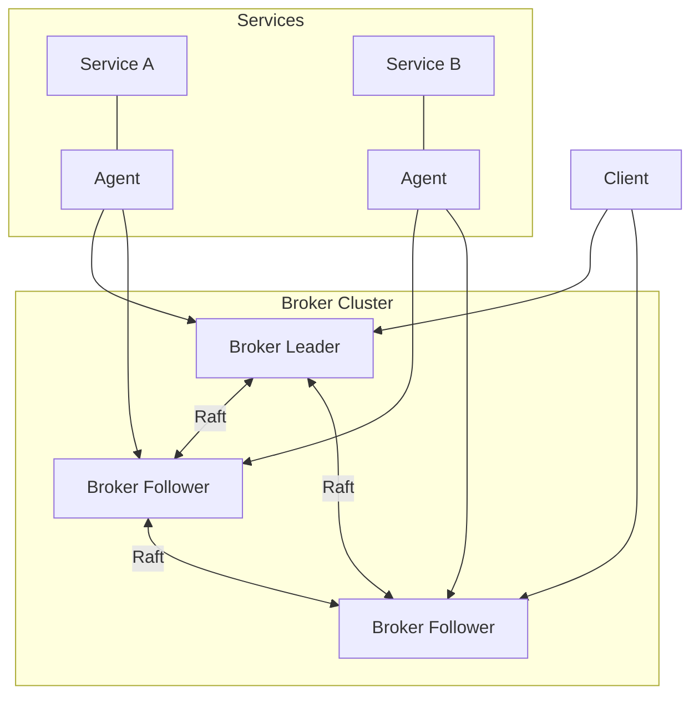
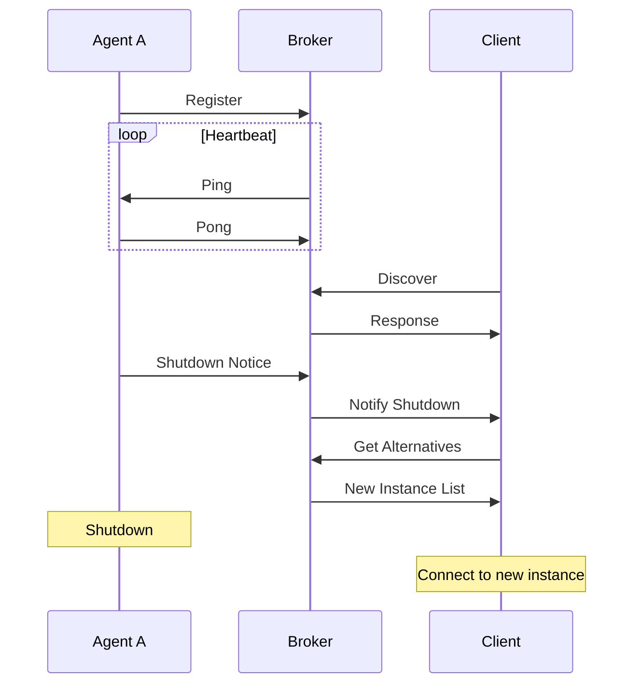

# Link Bridge: gRPC Service Discovery and Proxy

A distributed service discovery and proxy system using gRPC, supporting high availability through Raft consensus and automatic failover.

## System Design Principles

1. **State Distribution**
    - **Replicated State**: Service registry and agent information are replicated across the cluster using Raft
    - **Local State**: Client connections are managed locally by each broker
    - **Clean Separation**: No client state is included in cluster consensus

2. **High Availability**
    - Each broker independently handles client connections
    - Service and agent information remains consistent across broker failures
    - Clients can connect to any broker and receive consistent service information

## Architecture



## Connection Lifecycle



## Broker Clustering

### Raft Consensus

The broker cluster uses Raft consensus algorithm to maintain consistency of the service registry and agent information:

- Leader election for primary broker determination
- Log replication for service and agent state
- Automatic failover in case of leader failure
- Strong consistency for service registry updates

### State Management

```go
// Cluster shared state - replicated via Raft
type ClusterState struct {
    // Service registry - persistent service information
    Services map[string]*ServiceInfo
    // Agent registry - connected agent information
    Agents map[string]*AgentInfo
}

// Local broker state - not replicated
type LocalBrokerState struct {
    // Connected clients - ephemeral, local to each broker
    Clients map[string]*ClientInfo
    // Local connection tracking
    ActiveConnections *ConnectionTracker
}

// State machine implementation for Raft
type BrokerStateMachine struct {
    state *ClusterState
    mu    sync.RWMutex
}

func (b *BrokerStateMachine) Apply(log *raft.Log) interface{} {
    var cmd Command
    if err := json.Unmarshal(log.Data, &cmd); err != nil {
        return err
    }
    
    switch cmd.Type {
    case RegisterService:
        return b.applyRegister(cmd.Payload)
    case DeregisterService:
        return b.applyDeregister(cmd.Payload)
    case UpdateAgentStatus:
        return b.applyAgentUpdate(cmd.Payload)
    }
}
```

### Broker High Availability

Each broker maintains its own client connections while sharing the replicated service and agent state:

```go
// Example of broker state handling
type Broker struct {
    // Shared state managed by Raft
    clusterState *ClusterState
    
    // Local state
    localState *LocalBrokerState
    
    // Raft node
    raft *raft.Raft
    
    // Local broker configuration
    config *BrokerConfig
}

// Example of client connection handling
func (b *Broker) HandleClientConnect(client *Client) error {
    // Add to local state only
    b.localState.AddClient(client)
    
    // Provide current service registry from replicated state
    return b.SendServiceRegistry(client)
}
```

### Client Broker Failover

Clients can connect to any broker and receive consistent service information:

```go
// Example of client with broker failover handling
client := discovery.NewClient(ClientConfig{
    // List of broker addresses
    BrokerAddresses: []string{
        "broker-1:5000",
        "broker-2:5000",
        "broker-3:5000",
    },
    FailoverConfig: FailoverConfig{
        // Retry policy for broker connections
        RetryInterval: time.Second,
        MaxRetries: 3,
        // Automatic broker failover
        EnableAutoFailover: true,
        // Keep trying all brokers
        ContinuousRetry: true,
    },
})
```

### Advanced Cluster Operations

#### State Snapshots

State snapshots include only the replicated cluster state:

```go
// Configure state snapshots
broker.ConfigureSnapshots(SnapshotConfig{
    // Take snapshots every hour
    Interval: time.Hour,
    // Keep last 3 snapshots
    RetentionCount: 3,
    // Snapshot compression
    Compress: true,
})
```

#### Monitoring and Metrics

```go
// Example of cluster metrics
type ClusterMetrics struct {
    // Leader information
    LeaderID string
    LeaderUptime time.Duration
    
    // Consensus metrics
    CommitIndex uint64
    AppliedIndex uint64
    
    // Node status
    NodeStatus map[string]NodeState
    
    // Service and Agent metrics
    RegisteredServices int
    ConnectedAgents int
    
    // Local broker metrics
    LocalConnectedClients int
    LocalRequestLatency time.Duration
}
```

## Configuration Examples

```yaml
# Full broker cluster configuration
broker:
  node:
    id: "broker-1"
    address: "broker-1:5000"
    dataDir: "/var/lib/service-discovery"
  
  cluster:
    raft:
      port: 7000
      electionTimeout: "5s"
      heartbeatInterval: "500ms"
      snapshotInterval: "1h"
      snapshotRetention: 3
    
    members:
      - id: "broker-1"
        address: "broker-1:7000"
      - id: "broker-2"
        address: "broker-2:7000"
      - id: "broker-3"
        address: "broker-3:7000"
  
  # Local broker settings
  local:
    maxClients: 1000
    clientTimeout: "30s"
    
  shutdown:
    gracePeriod: "30s"
    notifyClients: true
```

## License

This project is licensed under the MIT License - see the [LICENSE](LICENSE) file for details.
